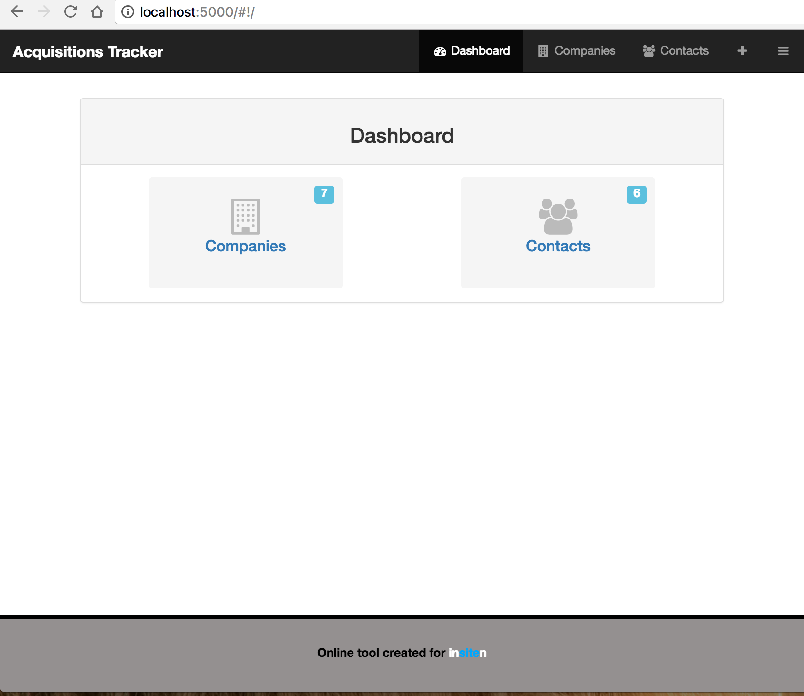
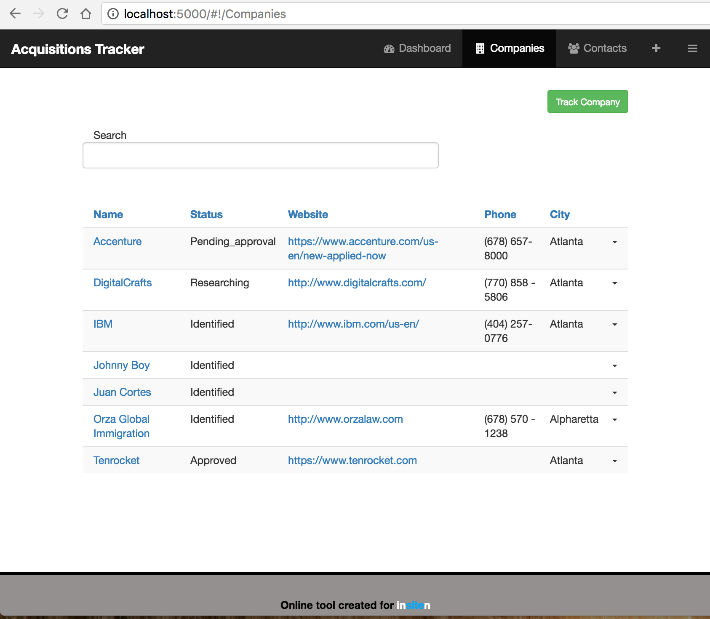
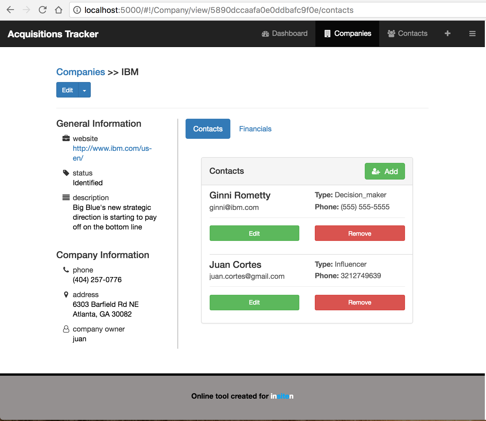
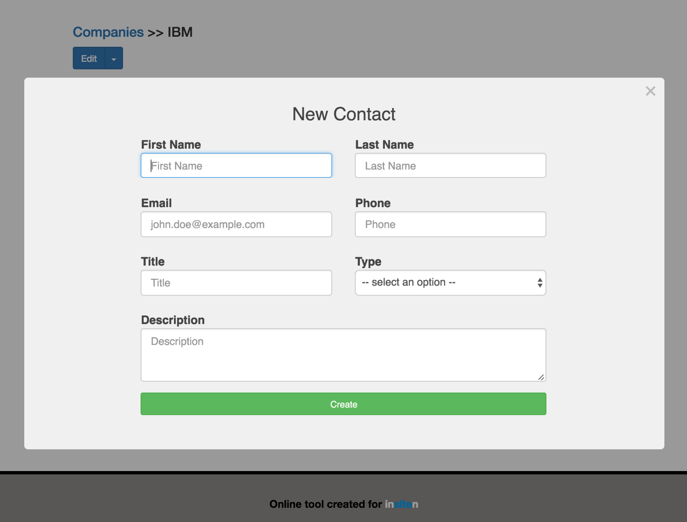

# Acquisitions Tracker

######
[Live Project](http://54.148.11.254:5000)   |   [Overview](https://github.com/jcortes0309/my_acquisitions/#overview)   |   [What I Used](https://github.com/jcortes0309/my_acquisitions/#what-i-used)   |  [Screenshots](https://github.com/jcortes0309/my_acquisitions/#screenshots)   | [Project History](https://github.com/jcortes0309/my_acquisitions/#project-history)

## Overview:
The acquisitions tracker app is an online tool that can be used to track and analyze potential target companies for mergers/acquisitions.

## What I used:
**Languages:**  
* HTML5
* CSS
* JavaScript (MEAN Stack)

**Frameworks:**  
* Angular JS 1.6.0 (including the following services: ui-router, angularMoment, ngDialog, ngFlash)
* Express JS
* Bootstrap

**Other:**  
* MongoDB
* Node JS
* Amazon Web Services EC2

## Screenshots
**Dashboard Page**

**Companies List**

**Company Profile Page**

**Add New Contact Modal**

## Project History
* 01/31/2017 - Project presentation to client
* 01/27/2016 - Project start
